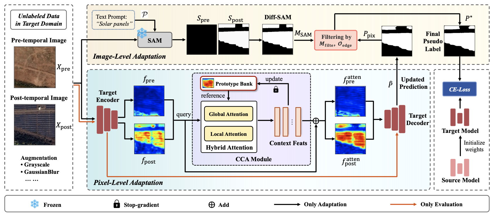

<h1 align="center">PA-TTA</h1>

<h3>Test-Time Adaptation for Photovoltaic Installation Growth Assessment</h3>

[Rui Huang](https://github.com/DonMuv)1, [Huanjing Yue](https://scholar.google.com/citations?user=1umAObUAAAAJ&hl=zh-CN&oi=sra)1, [Jianhua Guo](https://scholar.google.com/citations?user=xY0__WQAAAAJ&hl=zh-CN&oi=sra)2, [Xiaoqiang Lu](https://scholar.google.com/citations?user=FRyuu2IAAAAJ&hl=zh-CN&oi=sra)3, [Jingyu Yang](https://scholar.google.com/citations?user=x0jlbE4AAAAJ&hl=zh-CN&oi=sra)1 *

1 Tianjin University, 2 Chinese Academy of Sciences,  3 Fuzhou University, * Corresponding author

   

## Updates
* **` Notice`**: The code of this repo has been updated! We'd appreciate it if you could give this repo a ⭐️**star**⭐️ and stay tuned!!
* **` Jun. 11th, 2026`**: PA-TTA has been accepted by [IEEE TGRS](https://ieeexplore.ieee.org/)!

## Overview

* PA-TTA addressed both domain shift and catastrophic forgetting, enabling the detection of photovoltaic installation growth across diverse geographic regions without requiring ground-truth labels.

  

## Datasets
We provide the data for the [Telangana, India](https://drive.google.com/file/d/1hMTfYflfdnCwFqXacMuuvDZjZHsreIzL/view?usp=sharing) and [Bavaria, Germany](https://drive.google.com/file/d/1Ejx9_Ohjw2HPs6tH0DQ_W0PmksEXkmM3/view?usp=sharing) test regions, the complete dataset will be publicly released in the near future.

## Getting Started

